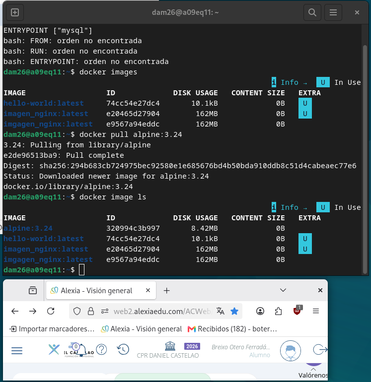
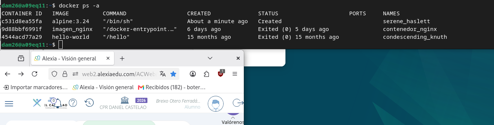
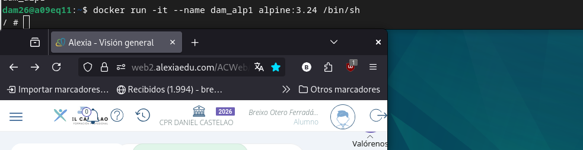
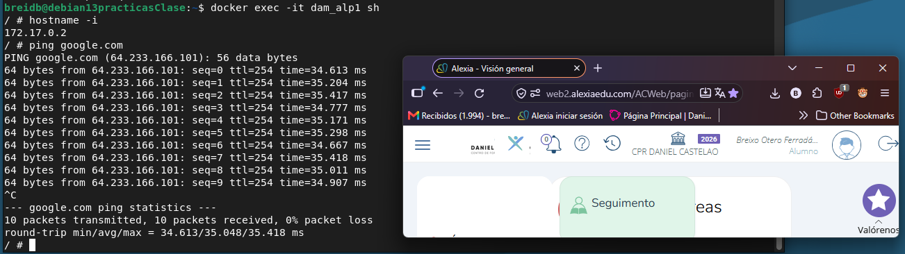
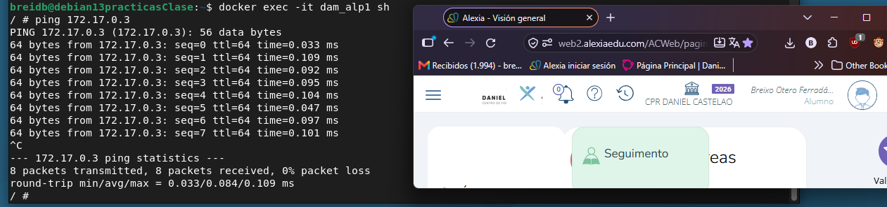
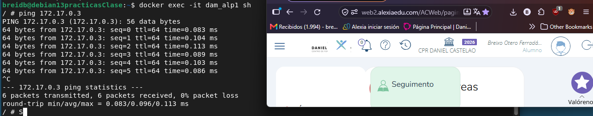
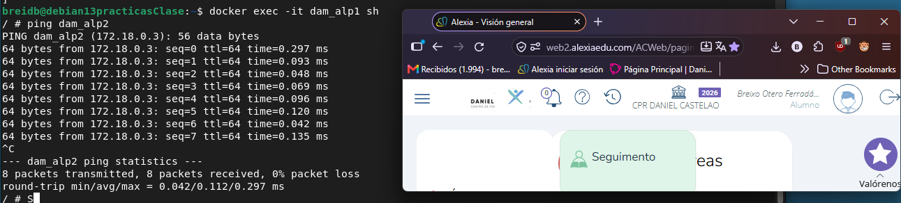
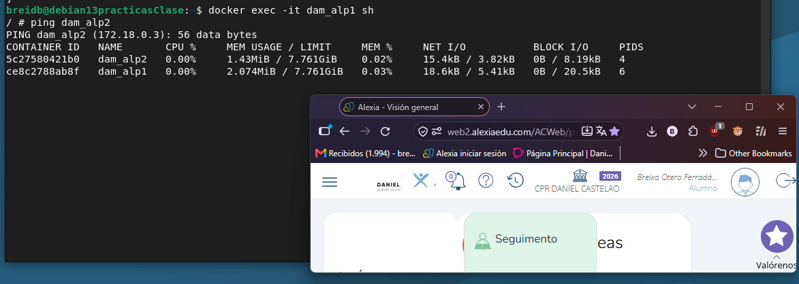
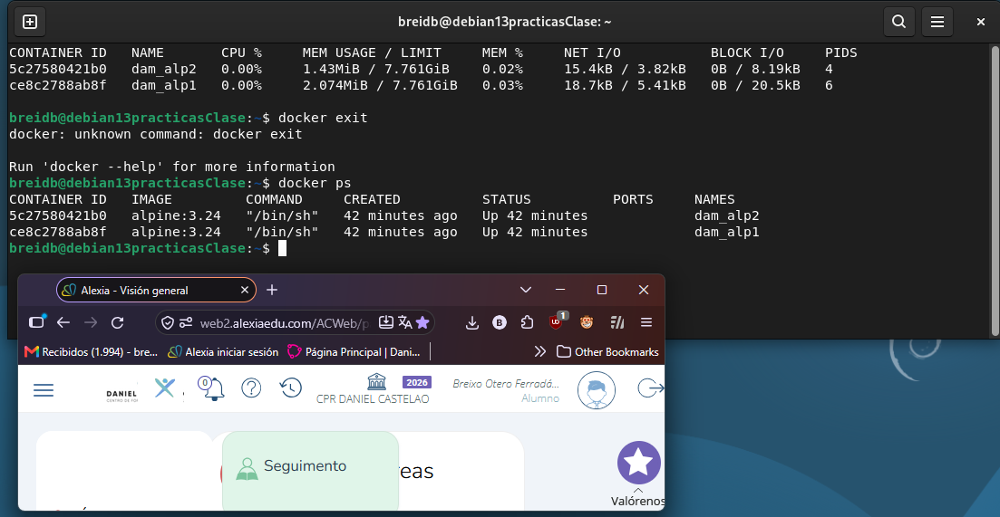
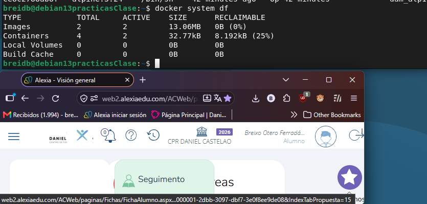

# SXE_Tarea03

## 1. Descarga la imagen de Alpine sin arrancarla y comprueba que la tienes. Fija la versión: no uses latest. Escoge una versión, de las disponibles en docker hub.



Elegi la version 3.24 para la version de alpine

#### Comandos:

Descargar la version especificada de alpine de Docker Hub:

```
docker pull alpine:3.24
```
Para comprobar que esta descargada:
```
docker image ls
```
## 2. Crea un contenedor sin nombre y sin arrancarlo. ¿En qué estado queda? ¿Qué nombre le ha puesto Docker?



#### Comandos

Crear el contenedor sin arrancarlo:
```
docker create alpine:3.24
```
Mostrar los contenedores existentes:
```
docker ps -a
```
El contenedor queda en estado de CREATED, y el nombre por defecto al no especificar ninguno serene_haslett ya que Docker genera automáticamente un nombre aleatorio combinando un adjetivo y el apellido de un científico o programador célebre (en este caso, la matemática y astrónoma Caroline Haslett).

## 3. Crea y arranca dam_alp1 con una shell. ¿Qué opciones necesitas para poder escribir dentro?



#### Comandos:
Crear un contenedor, detras de --name se pondra el nombre deseado para el contenedor
```
docker run -it --name {nombre} alpine:3.24 /bin/sh
```
Necesito:
<ul>
	<li>i (interactive): Mantiene abierta la entrada estándar (STDIN) para que se puedan escribir comandos</li>
	<li>t (tty): Asigna una consola/terminal virtual para ver la salida formateada</li>
	<li> /bin/sh : Intérprete de comandos</li>
</ul>

## 4. Desde dentro, mira qué IP tiene y si puede hacer ping a google.com.



#### Comandos:
Entrar en la linea de comandos del contenedor:
```
docker exec -it dam_alp1 sh
```
Ver la ip del contenedor:
```
hostname -i
```
Hacer ping a google.com:
```
ping google.com
```


## 5. Deja dam_alp1 funcionando sin pararlo y crea dam_alp2 igual. Con los dos en marcha, haz ping de uno a otro: por IP y por nombre. Explica cada resultado. 

### Ping por IP

 


Funciona correctamente y con 0% de pérdida de paquetes. Ambos contenedores comparten el mismo puente de red virtual (bridge) en la interfaz mired, lo que les permite enrutar paquetes IP directamente entre sí dentro del mismo rango de red. 

### Ping por nombre

 
 

Funciona correctamente debido a la resolución de nombres por DNS integrado de Docker. Como ambos contenedores fueron creados dentro de la red personalizada mired, Docker habilita un servidor DNS interno (escuchando en 127.0.0.11). Al escribir ping dam_alp2, la consulta DNS devuelve primero la IP asignada (172.19.0.3) y acto seguido envía los paquetes ICMP a esa dirección. 

## 6. Con los dos en marcha, averigua cuánta memoria consumen. ¿Hay un comando de Docker para eso?

 

#### Comandos:
```
docker stats
```

## 7. Sal con exit. ¿Qué les ha pasado? Repite el comando anterior: ¿qué ves ahora y por qué? 

 

Al hacer exit tras haber accedido mediante docker exec, los contenedores siguen en ejecución (Up). Solo se ha cerrado el proceso interactivo de la shell, mientras que el proceso principal (sleep) sigue activo en segundo plano.
Al repetir docker stats, seguimos viendo ambos contenedores listados y consumiendo recursos, ya que docker stats muestra en tiempo real todos los contenedores que permanecen en marcha. (Nota: Si se hubieran arrancado con docker run -it sin un proceso en segundo plano, al hacer exit el contenedor habría pasado a estado Exited y habría desaparecido de la lista de docker stats).
 

## 8. ¿Cuánto disco has ocupado? Distingue imágenes de contenedores. 

 

#### Comandos:
Saber el uso del disco:
```
sudo docker system df
```
#### Espacio ocupado por Imágenes: 13.06MB

Corresponde a la descarga de la imagen base de Alpine de Docker Hub.

#### Espacio ocupado por Contenedores: 32.77kB

Es el espacio en la capa de escritura propia de dam_alp1 y dam_alp2. Como no se han instalado paquetes nuevos ni guardado archivos grandes dentro                                    de ellos, la diferencia sobre la imagen base es prácticamente nula.


